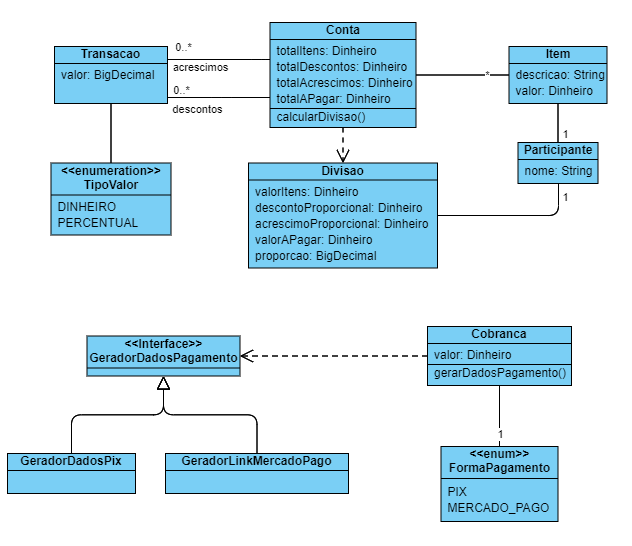
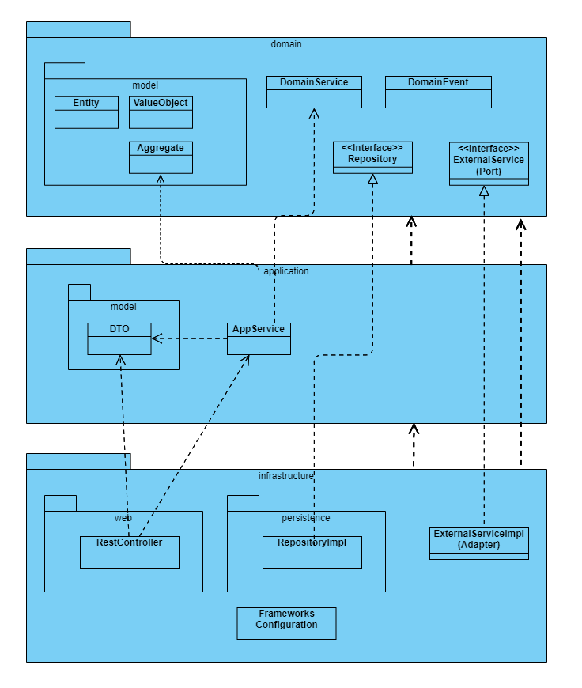

# Divide Conta

A ideia desta aplicação é resolver um problema comum no dia-a-dia de quem divide 
almoços/lanches com a equipe de trabalho. Vamos imaginar que você e mais um colega 
queiram dividir um lanche que estão pedindo pelo iFood/Uber Eats utilizando seu 
smartphone. Fica fácil descobrir quanto seu colega deverá lhe pagar quando não existe 
nenhum desconto ou valor de entrega, porém quando estes fatores entram em questão, 
simplesmente dividir o valor no meio pode não ser o mais justo.

## Requisitos

https://github.com/ArturSch/DesafioBackendSE

## Modelo de Domínio

## Arquitetura

## Links
- [Documentação Swagger](https://divide-conta-api.herokuapp.com/swagger-ui/index.html)
- [Divide Conta Frontend](https://github.com/fmarlon/divide-conta-front)

